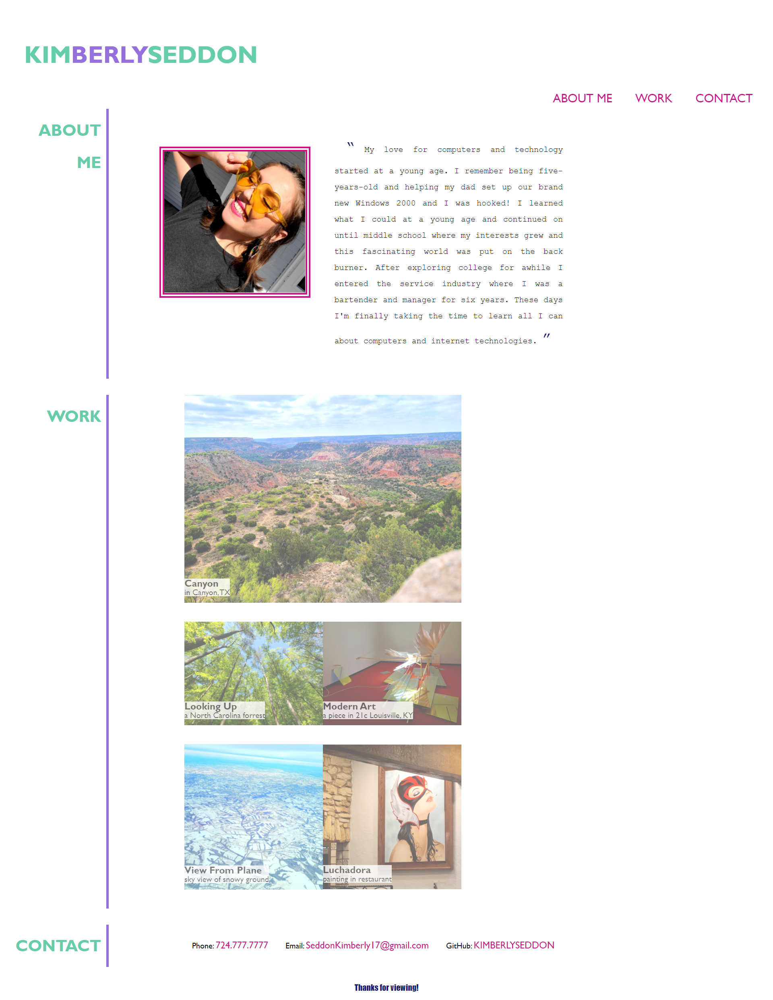

# my-portfolio

## Description

This is my first professional portfolio of work so that employers can see what I have to offer. This application showcases finished projects in a unique and professional way. I used only HTML and CSS in this project and it helped me solidify information learned in this unit.

## Installation

To view this application visit the website provided: 
https://kimberlyseddon.github.io/my-portfolio/

## Usage

While visiting webpage read descriptions and hover over project card placeholders to view expanded versions.
Soon placeholders will be replaced with completed projects.

## Credits

I learned a lot of information from instructor and attempting to recreate the example mock-up in my own way.